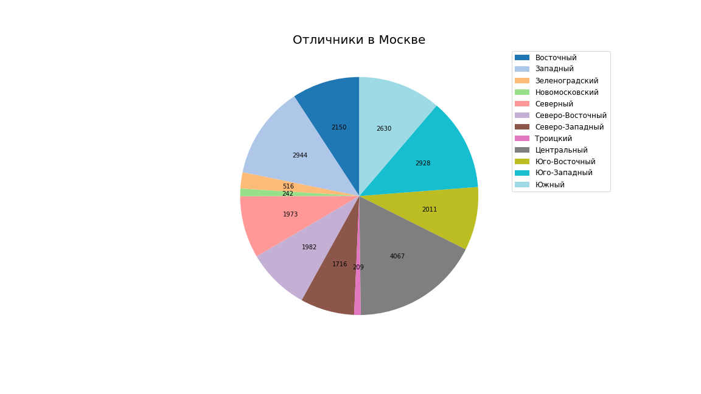

## Автоматический отчет
***
В данном скрипте решается задача загрузки данных в виде csv-файла, его обработка, вычисление различных метрик и их визуализация. Отчет формируется через base-64-форматирование в html- и pdf-формтах и автоматически отправляется на электронную почту заказчика.
***
### Окружение
Для реализации проекта необходима установка Python 3
***
### Необходимые ресурсы
Необходимо подключение следующих библиотек:
```python
import pandas as pd
import binascii
import pdfkit
from jinja2 import Template
import matplotlib.pyplot as plt
import smtplib
from email import encoders
from email.mime.text import MIMEText
from email.mime.base import MIMEBase
from email.mime.multipart import MIMEMultipart
```
***
### Пример визуализации
В данном расчете использовались данные по сдаче ЕГЭ в Москве. В диаграмме приведено распределение отличников (более 220 баллов) по округам города Москва в 2018-2019 годах

***
### Благодарности
Данный проект создан в рамках учебного курса Online - центра ускоренного получения IT профессий и повышения квалификации ITtensive

[](https://ittensive.com/)
