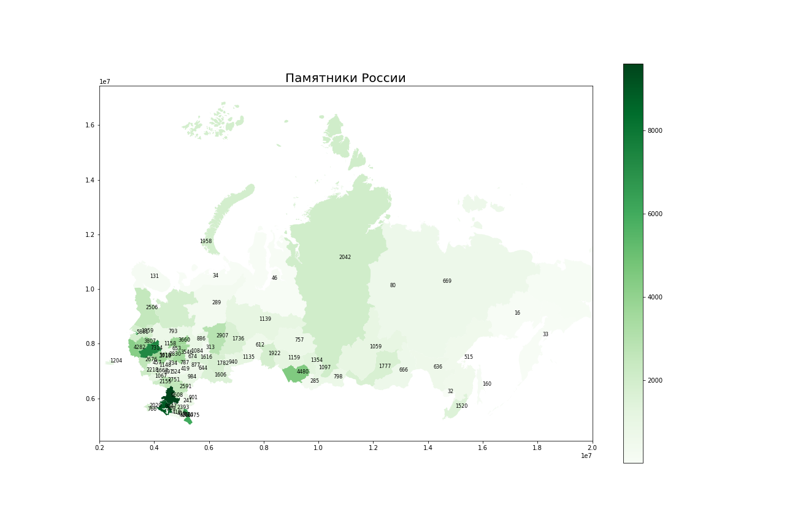

## Объекты культурного наследия на карте России
***
В данном проекте из набора данных по объектам культурного наследия России выбираются памятники по регионам и наносятся на карту России.
***
### Окружение
Для реализации проекта необходима установка Python 3
***
### Необходимые ресурсы
Необходимо подключение следующих библиотек:
```python
import matplotlib.pyplot as plt
import geopandas as gpd
import pandas as pd
import descartes
```
***
### Пример визуализации
Загружаются данные по объектам культурного наследия из csv-файла и гео-данные из json. Для объединения датафреймов редактируется объединяющий столбец.
Количество объектов культурного наследия выводится в виде аннотации из результирующего набора.

***
### Благодарности
Данный проект создан в рамках учебного курса Online - центра ускоренного получения IT профессий и повышения квалификации ITtensive

[](https://ittensive.com/)
